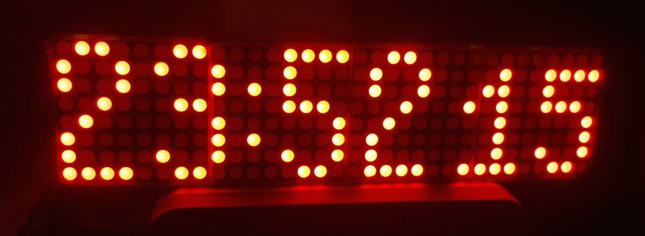

Newbie's guide to adamkov's esp-matrixclock

This HOWTO is by the courtesy of Vajk

### HW BOM:
- [nodemcu v3 board](http://www.banggood.com/Geekcreit-Doit-NodeMcu-Lua-ESP8266-ESP-12E-WIFI-Development-Board-p-985891.html)
- [max7219 based led matrix](https://www.banggood.com/MAX7219-Dot-Matrix-Module-4-in-1-Display-For-Arduino-p-1072083.html)
- micro usb cable
- female-female dupont cable 5pcs

connect display - nodemcu:
- VCC - 3V
- GND - G
- DIN
- CS
- CLK
TODO: find mapping to D6, D7, D8

connect nodemcu board to pc usb, wait till serial driver installs ok. On Windows can use Control panel, Device manager, ports to check COM port number added.

### SW:
- arduino ide: [https://www.arduino.cc/en/main/software](https://www.arduino.cc/en/main/software) 
   - download, install
   - File, Preferences: Additional Boards Manager URLs: [http://arduino.esp8266.com/stable/package_esp8266com_index.json](http://arduino.esp8266.com/stable/package_esp8266com_index.json) 
- esp-matrixclock fw: [https://github.com/adamkovesdi/esp-matrixclock](https://github.com/adamkovesdi/esp-matrixclock) 
   - download as zip, unzip
   - open esp-matrixclock.ino in arduino ide
- NTP client lib: [https://github.com/arduino-libraries/NTPClient/](https://github.com/arduino-libraries/NTPClient/) 
   - download as zip, unzip to program files/Arduino/libraries
- ArduinoJson lib: [https://github.com/bblanchon/ArduinoJson](https://github.com/bblanchon/ArduinoJson) 
   - download as zip, unzip to program files/Arduino/libraries
- Openweathermap: [http://openweathermap.org/](http://openweathermap.org/) 
   - register an account
   - get your api key at: [https://home.openweathermap.org/api_keys](https://home.openweathermap.org/api_keys) 
   - find your location/city id on here: [http://openweathermap.org/help/city_list.txt](http://openweathermap.org/help/city_list.txt) 
- In Arduino ide
   - in file esp-matrixclock (the one that opened by default)
      - uncomment the four lines starting #define MYSSID
      - add your SSID/PSK (wifi access point name, key)
      - add your api key from openweathermap
      - add your city id from same
      - save file
   - Tools, Board: select ESP8266 generic module
   - Tools, Port: select COM port
   - Tools, Reset method: set to nodemcu
   - click upload (right arrow button below menu bar)

You are done.
