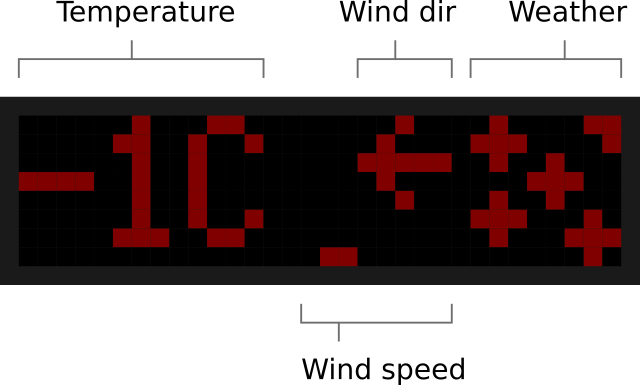

# Dot matrix clock with weather and NTP

This is my dot matrix clock made with ESP8266 WiFi capable MCU. Accurate time signal is acquired from NTP and weather information is available through Openweathermap.org API.

The firmware should be compiled on your computer using Arduino IDE and then uploaded to the ESP module. This is not a trivial task but there is a HOWTO section to make it easier with a step-by-step tutorial.


## Features
- 24 hour time display
- NTP sync
- Optional weather data from Openweathermap.org API
- Outside temperature display
- Wind speed display
- Wind direction display
- DST support (automatic change)
- Serially configurable wifi credentials 


## Prerequisites
- ESP8266 board (recommended: NodeMCU/compatible see BOM)
- MAX7219 based LED matrix display (order from China)
- *Openweathermap account (optional)*
- Arduino IDE + libraries (see below, and READ Software installation section)

## Time display screen


## Weather display screen
Current weather is displayed 3 times per minute for 4 seconds.



## Build & Installation HOWTO

### Hardware BOM

- [NodeMCU v3 board](http://www.banggood.com/Geekcreit-Doit-NodeMcu-Lua-ESP8266-ESP-12E-WIFI-Development-Board-p-985891.html)
- [MAX7219 based LED matrix](https://www.banggood.com/MAX7219-Dot-Matrix-Module-4-in-1-Display-For-Arduino-p-1072083.html)
- Micro usb to USB cable
- Female-female dupont cable 5pcs (usually comes with the display)

### Wiring between NodeMCU and matrix board

```
NodeMCU 3.3V -> Matrix Vcc
NodeMCU GND  -> Matrix GND
NodeMCU D8   -> Matrix DIN
NodeMCU D7   -> Matrix CS
NodeMCU D6   -> Matrix CLK
```

### Software installation

- Download & Install Arduino IDE (1.8.8 at the time of writing)
[https://www.arduino.cc/en/main/software](https://www.arduino.cc/en/main/software) 

In Arduino IDE
- File/Preferences/Additional Board Manager URLs: [http://arduino.esp8266.com/stable/package_esp8266com_index.json](http://arduino.esp8266.com/stable/package_esp8266com_index.json)
- Tools/Boards/Board Manager: Install esp8266
- Tools/Board: select NodeMCU 1.0 (ESP 12-E Module)
- Tools/Manage Libraries: search for & install ArduinoJSON by bblanchon version 5.13.4 (version 6.x.x will not work!)
- Tools/Manage Libraries: search for & install Time 1.5.0 by Michael Margolis
- *NTP Client lib is no longer a dependency (courtesy of @moeur)*

Optional steps for weather info functionality

- Openweathermap: [http://openweathermap.org/](http://openweathermap.org/) 
	- Register an account
	- Get your API key at: [https://home.openweathermap.org/api_keys](https://home.openweathermap.org/api_keys) 
	- Find your location/city id on here: [https://openweathermap.org/find?q=](https://openweathermap.org/find?q=) 

- Changes in file *esp-matrixclock.ino* needed for weather functionality
	- Add your api key from openweathermap: uncomment define WEATHERKEY
	- Add your city id from same
	- Save file

### Uploading

- Tools, Board: select NodeMCU 1.0 (ESP 12-E Module)
- Tools, Port: select COM port
- Click upload (arrow button below menu bar on the upper left)

Upload parameters (tested with Arduino IDE 1.8.8):
```
Board: "NodeMCU 1.0 (ESP-12E Module)"
Upload Speed: "115200"
CPU Frequency: "80MHz"
Flash Size: "4M (1M SPIFFS)"
Debug: Disabled, None
IwIP Variant: "v2 Lower Memory"
VTables: "Flash"
Erase Flash: "Only Sketch"
```

### Wifi Configuration

- If the clock fails to connect to an AP it will ask for credentials
- Run serial monitor (Arduino IDE) or minicom/putty, etc at 9600 bps
- Type in your own Wifi credentials

## Future plans

- Openweathermap API keys to EEPROM
- Force configuration mode (button/jumper, etc)

## Special thanks

- Vajk for beta testing & original HOWTO
- [William Moeur](https://github.com/moeur) for NTP code improvements and credentials config

